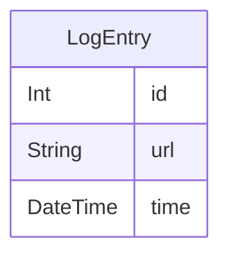

# Backend

This backend uses Express and Node.JS to serve as a proxy. It accepts simple GET requests, converts them into the PEKA server requests, processes the data, and returns a more logical and stable JSON

# Initialization

## Database

SQLite database must be initialized before using the project

```
npx prisma generate
npx prisma migrate deploy
```

The database will be located at `backend/log.db`. The server does not read the database.
It is only there for testing purposes, or for some special cases where logging requests is necessary.

The database consists of one table storing every HTTP request to the API, and looks as follows:



Use a program like [DB Browser for SQLite](https://sqlitebrowser.org/) to display the log entries.

## Starting the app

### Development

```
npm run dev
```

This starts nodemon to automatically refresh on changes.

### Production

```
npm run prod
```

This compiles TypeScript to JS and starts the server.

### Environment variables
You can configure the following variables. The server will run on that host and port, while proxying the given external server.

```
PORT=5000
HOST=127.0.0.1  (aka localhost)
PEKA_VM_URL=https://www.peka.poznan.pl/vm/method.vm
```

Values mentioned above are set by default.

# API

The API contains several `GET` endpoints, available under `/api/` route.

> [!NOTE]
> Please note that the requests are throttled to `20` requests per `10` seconds! Sending more requests should be avoided anyway, since the PEKA server might rate-limit you at some point.

## Glossary

`stop` - a group of bollards (or just one bollard), identified by a common name

`bollard` - a physical location where vehicles stop

## Errors

You may expect the following HTTP codes:

- `404` - resource not found
- `422` - missing query parameters
- `429` - too many requests (rate limiter just kicked in yo)
- `500` - internal or external server failure

## /stops

Returns a list of stops (a stop then has bollards) matching the search query. May be limited to first few.

#### params
- `q` - query to search for (optional)

#### example

```
GET localhost:5000/api/stops?q=Dworzec
```

```json
[
   {
      "symbol":"DODWK",
      "name":"Dopiewo/Dworzec Kolejowy"
   },
   {
      "symbol":"DWZA",
      "name":"Dworzec Zachodni"
   },
   {
      "symbol":"MODWK",
      "name":"Mosina/Dworzec Kolejowy"
   },
   {
      "symbol":"PADWR",
      "name":"Palędzie/Dworzec Kolejowy"
   },
   // .....
]
```

#### remarks

`symbol` - unique identifier of the stop group, currently not needed for further requests

`name` - name of the stop group

## /bollards

Returns a list of bollards (actual places where vehicles stop) for a given stop group name

#### params
- `name` - name of the stop to find bollards for

#### example

```
GET localhost:5000/api/bollards?name=Różana
```

```json
[
   {
      "name":"Różana",
      "symbol":"ROZA41",
      "directions":[
         {
            "lineName":"9",
            "direction":"Dębiec PKM"
         },
         {
            "lineName":"9",
            "direction":"Głogowska/Hetmańska"
         },
         {
            "lineName":"19",
            "direction":"Dębiec PKM"
         },
         {
            "lineName":"19",
            "direction":"Franowo"
         }
      ]
   },
   {
      "name":"Różana",
      "symbol":"ROZA42",
      "directions":[
         {
            "lineName":"9",
            "direction":"Piątkowska"
         },
         {
            "lineName":"19",
            "direction":"Połabska"
         }
      ]
   }
]
```

#### remarks
`symbol` - unique identifier of the bollard, used for further requests

`directions` - a list of lines departing from this bollard

## /departures

Returns a list of the departures for a given bollard, along with announcements if available.

#### params
- `bollard_symbol` - symbol of the bollard to find departures for

#### example

```
GET localhost:5000/api/departures?bollard_symbol=ROZA41
```

```json
{
   "bollardName":"Różana",
   "bollardSymbol":"ROZA41",
   "announcements":[
      {
         "content":"Od czwartku do soboty, od 29 do 31 maja w związku z organizacją imprez i wydarzeń w ramach Juwenaliów wzmocniona zostanie komunikacja nocna. Funkcjonować będą linie tramwajowe nr 201, 202, 204 i 205. ",
         "startDate":"2025-05-27",
         "endDate":"2025-05-31"
      }
   ],
   "departures":[
      {
         "line":"9",
         "direction":"Dębiec PKM",
         "departure":"17:11",
         "minutes":2,
         "realTime":true,
         "onStopPoint":false,
         "vehicle":{
            "id":"442",
            "airConditioned":true,
            "bike":true,
            "chargers":true,
            "lowEntrance":true,
            "lowFloor":false,
            "ramp":true,
            "ticketMachine":false
         }
      },
      {
         "line":"19",
         "direction":"Dębiec PKM",
         "departure":"17:21",
         "minutes":12,
         "realTime":true,
         "onStopPoint":false,
         "vehicle":{
            "id":"244",
            "airConditioned":false,
            "bike":true,
            "chargers":false,
            "lowEntrance":false,
            "lowFloor":false,
            "ramp":false,
            "ticketMachine":false
         }
      },
      {
         "line":"9",
         "direction":"Dębiec PKM",
         "departure":"17:31",
         "minutes":22,
         "realTime":true,
         "onStopPoint":false,
         "vehicle":{
            "id":"460",
            "airConditioned":true,
            "bike":true,
            "chargers":true,
            "lowEntrance":true,
            "lowFloor":false,
            "ramp":true,
            "ticketMachine":false
         }
      }
   ]
}
```

#### remarks
`announcements` - a list with the available announcements, usually empty. The field itself is always present

`departures` - a list of the departures

`vehicle` - optional information about the vehicle, only if available and for real time departures. This field may not appear. Furthermore, all fields except `id` are optional and may not appear

## /lines

Returns a list of lines matching the search query. May be limited to first few.

#### params
- `q` - query to search for (optional)

#### example

```
GET localhost:5000/api/lines?q=17
```

```json
[
   "17",
   "170",
   "171",
   "173",
   "174",
   "175",
   "176",
   "177",
   "178",
   "179"
]
```

#### remarks
The line names are always a string

## /line

Returns all variants (forwards, backwards, optional depot exits) of line, and lists of the stops it goes through

#### params
`name` - name of the line to search for

#### example
```
GET localhost:5000/line?name=171
```

```json
[
   {
      "direction":"Os. Dębina",
      "bollards":[
         {
            "name":"Os. Wichrowe Wzgórze",
            "symbol":"OWW02",
            "orderNo":1
         },
         {
            "name":"Os. Kosmonautów",
            "symbol":"OKOS02",
            "orderNo":2
         },
         {
            "name":"Rondo Solidarności",
            "symbol":"ROSO03",
            "orderNo":3
         },
         // .....
         {
            "name":"Azaliowa",
            "symbol":"AZAL01",
            "orderNo":29
         },
         {
            "name":"Os. Dębina",
            "symbol":"OSDE01",
            "orderNo":30
         }
      ]
   },
   {
      "direction":"Os. Wichrowe Wzgórze",
      "bollards":[
         {
            "name":"Os. Dębina",
            "symbol":"OSDE02",
            "orderNo":1
         },
         {
            "name":"Azaliowa",
            "symbol":"AZAL02",
            "orderNo":2
         },
         {
            "name":"Łozowa",
            "symbol":"LOZO02",
            "orderNo":3
         },
         // .....
         {
            "name":"Os. Kosmonautów",
            "symbol":"OKOS01",
            "orderNo":28
         },
         {
            "name":"Os. Wichrowe Wzgórze",
            "symbol":"OWW01",
            "orderNo":29
         }
      ]
   }
]
```

#### remarks
`symbol` - symbol of the actual bollard (not the whole stop group) the line passes through. Can be used to fetch departures

`orderNo` - usually indicates the order number of a particular stop in relation to the whole line. **Usage not recommended**. The values are completely unexpected for complex lines

> [!WARNING]  
> The stops are not guaranteed to appear in a logical order. The server sends really weird values, and the depot exit variants are sometimes mixed with the normal routes. I have no control over it, and it is impossible to decrypt, since the values are often literally wrong.